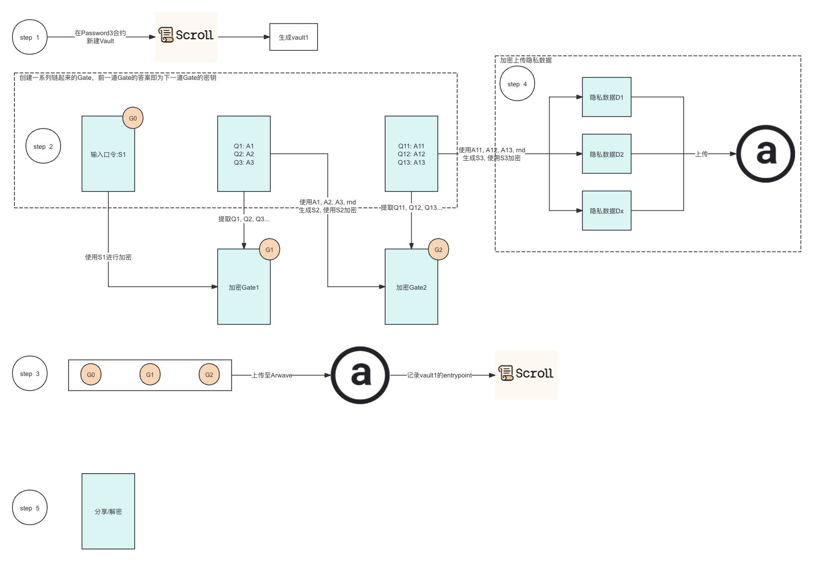

#  Password3

[Password3](https://password3.vercel.app/) 是一款基于区块链的去中心化应用. 用户通过设置加密口令/问答等形式生成加密密钥, 并在客户端使用加密密钥对敏感数据进行**加密**,并将加密数据**永久存储**至去中心化存储平台 arweave.用户可以分享这些加密数据的入口给相关人, 只需要他们知道口令或者能回答对问题即可查看.

### 实现原理

每个 Gate（加密层）都是下一个 Gate 的密钥，依次递进, 最后一个 Gate 生成的密钥加密的敏感数据. 无后端服务器, 完全透明.

### 功能

- 创建 Vault: Vault 为保存私密数据(Item)的容器. 一个地址可以创建多个 Vault.
- 创建 Gates : 自定义口令或者问题和答案, 对称加密 Gate 数据并上传至 arweave. 其中密钥仅会在本地使用不会上传. 上传的 Gates 文件 TxId 会被设置为当前 Vault 的 entrypoint
- 添加 Items: 一个 Vault 可以添加多个 Item, 这些 Item 同样会被加密上传.
- 分享: 可以以 url 的形式分享; 也可以分享给指定地址.

### 技术栈

- 前端: React + RainbowKit + NextJS
- [合约](https://github.com/Azleal/password3-contract): Foundry + solidity + scroll
- 存储: Irys + Arweave
